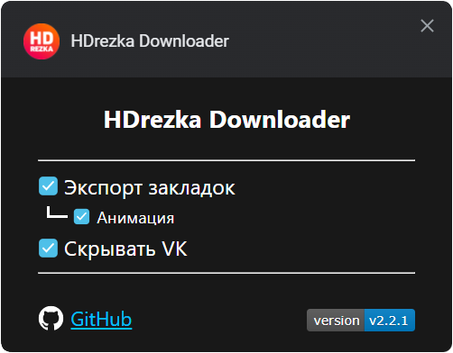
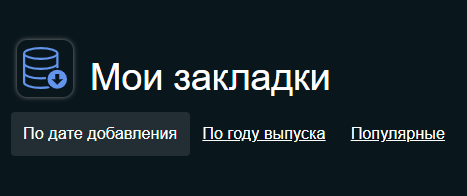

# HDrezka Helper

Добавляет кнопку «Скачать» под видео. Экспорт закладок и многое другое.


<a href="https://github.com/SuperZombi/HDrezka-downloader/releases">
   
   Скачать
</a>

#### Работает с новым API от 05.01.2022

<hr></br>

<p align="center">
   
</p>

## Установка:
1. ```Code``` > ```Download Zip```.
2. Извлеките папку ```src``` в место для установки.
3. ```⋮``` > ```Дополнительные инструменты``` > ```Расширения```.
4. Включите ```Режим разработчика```.
5. Нажмите ```Загрузить распакованое расширение```.
6. Выберите путь к папке ```src```.

## Настройки
<details><summary></summary>
<p align="center">
   
</p>
</details>

## Новое:
* <details><summary>Экспорт закладок.</summary></details>
* Скрытие блока с группой ВК.
<hr>

#### <a href="https://www.donationalerts.com/r/super_zombi">Поддержать</a>
