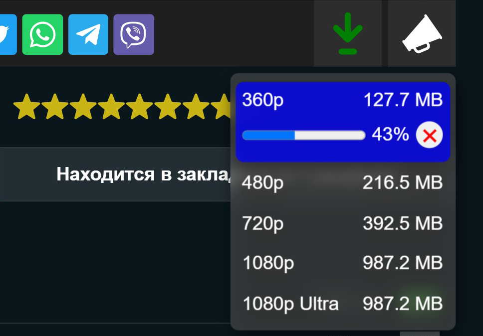
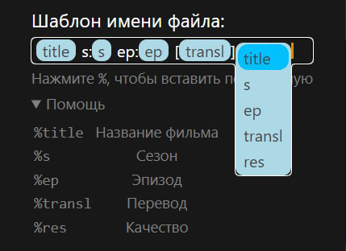

# HDrezka Helper

Добавляет кнопку «Скачать» под видео. Экспорт закладок и многое другое.


<p align="right">
    
    <a href="#донат"></a>
</p>

</br>

<p align="center">
   
</p>

###  У зв'язку з блокуванням Hdrezka в Україні, рекомендується використовувати VPN⚠️

### ❗️ТЕПЕР ПРАЦЮЄ І НА ЗЕРКАЛАХ

## Установка:

### [Магазин Chrome](https://chrome.google.com/webstore/detail/hdrezka-helper/dccbdaopjpaemaleakdlahglfbhkdldj)
### Chrome:
  1. Скачайте последний **[Релиз](https://github.com/SuperZombi/HDrezka-downloader/releases)**.
  2. Извлеките папку ```src``` в место для установки.
  3. ```⋮``` > "Дополнительные инструменты" > "Расширения".
  4. Включите "Режим разработчика".
  5. Нажмите "Загрузить распакованое расширение".
  6. Выберите путь к папке ```src```.
  
### Tampermonkey (Устарел):
1. Установите **[Tampermonkey](https://www.tampermonkey.net/)**.
2. Установите **[Скрипт](https://raw.githubusercontent.com/SuperZombi/HDrezka-downloader/main/hdrezka_helper.user.js)**.


## Настройки
<details><summary></summary>
<p align="center">
   
</p>
</details>

## Новое:
* <details><summary>Импорт и Экспорт закладок.</summary></details>
* Скрытие блока с группой ВК.
* Скачивание субтитров
* <details><summary>Downloader 2.0</summary>
   (Шаблон имени скачанного файла + быстрая загрузка внутри страницы)
   
   
</details>
<hr>

#### 💲Донат
<table>
  <tr>
    <td>
       
    </td>
    <td>
      <a href="https://donatello.to/super_zombi">Donatello</a>
    </td>
  </tr>
  <tr>
    <td>
       
    </td>
    <td>
      <a href="https://www.donationalerts.com/r/super_zombi">Donation Alerts</a>
    </td>
  </tr>
</table>
