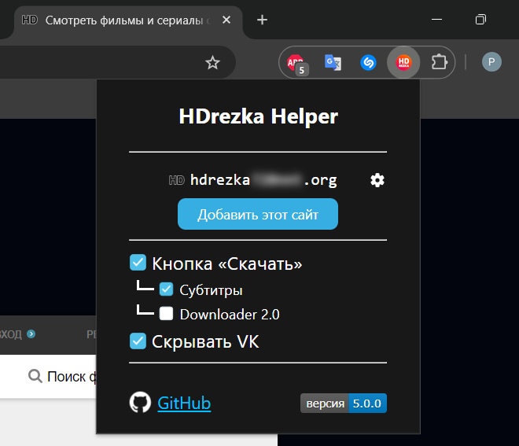

# HDrezka Helper

Скачивает фильмы и субтитры. Поддерживает зеркала.

<p>
    
    <a href="#донат"></a>
</p>

</br>

<p align="center">
   
</p>

###  У зв'язку з блокуванням Hdrezka в Україні, рекомендується використовувати VPN!

## Установка:

###  [Магазин Chrome](https://chrome.google.com/webstore/detail/hdrezka-helper/dccbdaopjpaemaleakdlahglfbhkdldj)
###  [Магазин Firefox](https://addons.mozilla.org/firefox/addon/hdrezka-helper/)

<hr>

### Chrome:
  1. Скачайте последний **[Релиз](https://github.com/SuperZombi/HDrezka-downloader/releases)**.
  2. Извлеките папку ```src``` в место для установки.
  3. ```⋮``` > "Дополнительные инструменты" > "Расширения".
  4. Включите "Режим разработчика".
  5. Нажмите "Загрузить распакованое расширение".
  6. Выберите путь к папке ```src```.
  
### Tampermonkey (Устарело):
1. Установите **[Tampermonkey](https://www.tampermonkey.net/)**.
2. Установите **[Скрипт](https://raw.githubusercontent.com/SuperZombi/HDrezka-downloader/main/hdrezka_helper.user.js)**.


## Настройки
<details><summary></summary>
<p align="center">
   
</p>
</details>

## Как добавить своё зеркало
<details><summary></summary>
  
  1. Откройте страницу зеркала.
  2. В верхнем правом меню, где нарисован пазл, выберите иконку плагина.
  3. В открывшемся окне нажмите "Добавить сайт"
<p align="center">
   
</p>
</details>

## Новое:
* Скачивание субтитров
* <details><summary>Downloader 2.0</summary>
   (Шаблон имени скачанного файла + быстрая загрузка внутри страницы)
   
   
  </details>

* Мобильный режим
* Скрытие блока с группой ВК.
* <details><summary>Импорт и Экспорт закладок. (устарело)</summary></details>
<hr>

#### 💲Донат
<table>
  <tr>
    <td>
       
    </td>
    <td>
      <a href="https://donatello.to/super_zombi">Donatello</a>
    </td>
  </tr>
  <tr>
    <td>
       
    </td>
    <td>
      <a href="https://www.donationalerts.com/r/super_zombi">Donation Alerts</a>
    </td>
  </tr>
</table>
