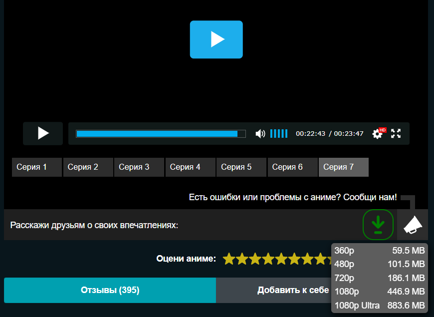

# HDrezka-downloader
Adds a Download button below the video




## Установка:
1. ```Code``` > ```Download Zip```.
2. Извлеките папку ```src``` в место для установки.
3. ```⋮``` > ```Дополнительные инструменты``` > ```Расширения```.
4. Включите ```Режим разработчика```.
5. Нажмите ```Загрузить распакованое расширение```.
6. Выберите путь к папке ```src```.
