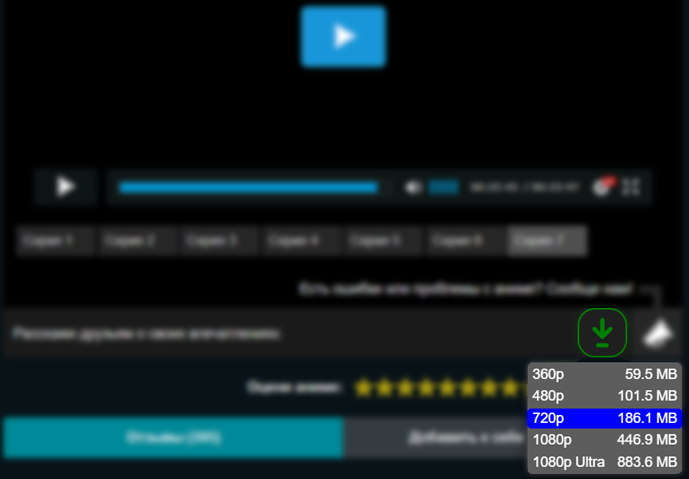

# HDrezka downloader

Добавляет кнопку «Скачать» под видео.


#### Работает с новым API от 05.01.2022

<hr></br>

<p align="center">
   
</p>

## Установка:
1. ```Code``` > ```Download Zip```.
2. Извлеките папку ```src``` в место для установки.
3. ```⋮``` > ```Дополнительные инструменты``` > ```Расширения```.
4. Включите ```Режим разработчика```.
5. Нажмите ```Загрузить распакованое расширение```.
6. Выберите путь к папке ```src```.

<hr>

#### <a href="https://www.donationalerts.com/r/super_zombi">Поддержать</a>
